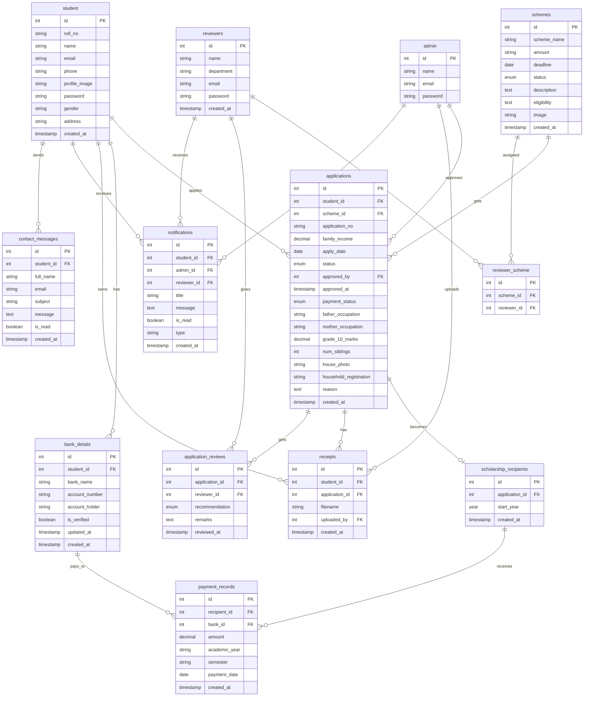
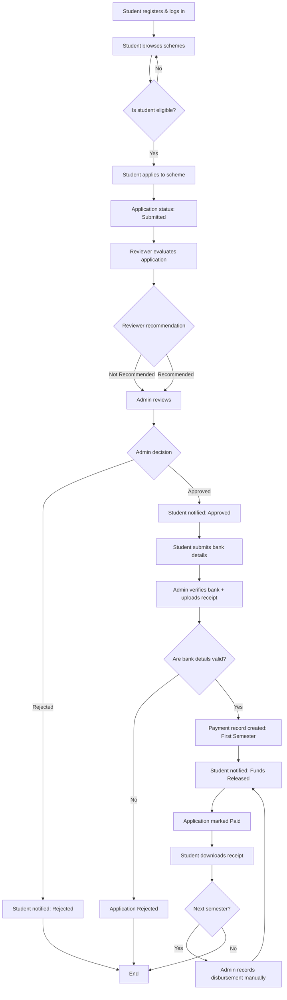
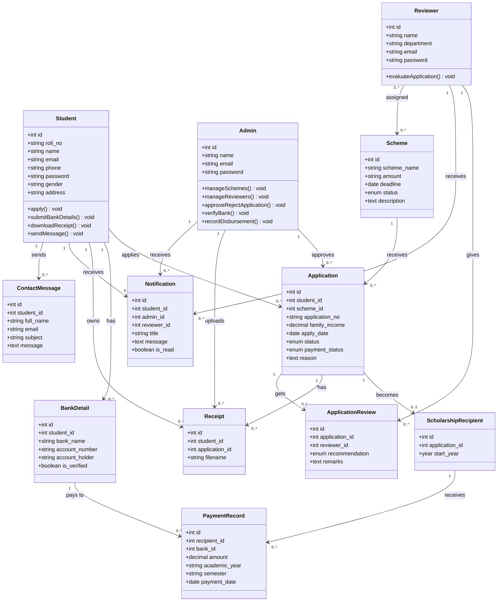

# EduGrant ER Diagram (Mermaid)



# Use Case Diagrams

## Student

```mermaid
usecaseDiagram
    actor Student

    Student --> (Register Account)
    Student --> (Login)
    Student --> (Logout)
    Student --> (Browse Schemes)
    Student --> (Apply to Scheme)
    Student --> (Submit Bank Details)
    Student --> (Track Application Status)
    Student --> (View Application Details)
    Student --> (Download Receipt)
    Student --> (View Notifications)
    Student --> (Manage Profile)
    Student --> (Send Message to Admin)
    (Apply to Scheme) ..> (Login) : <<include>>
    (Submit Bank Details) ..> (Login) : <<include>>
```

## Admin

```mermaid
usecaseDiagram
    actor Admin

    Admin --> (Login)
    Admin --> (Logout)
    Admin --> (View Dashboard)
    Admin --> (Manage Schemes)
    Admin --> (Manage Reviewers & Assign Schemes)
    Admin --> (Review & Approve/Reject Applications)
    Admin --> (Verify Bank & Disburse Funds)
    Admin --> (Manage Recipients)
    Admin --> (Record Disbursements)
    Admin --> (View Reports)
    Admin --> (Read Student Messages)
    Admin --> (View Notifications)
    Admin --> (Manage Students)
    Admin --> (Search Records)
    (Verify Bank & Disburse Funds) ..> (Upload Receipt) : <<include>>
    (Verify Bank & Disburse Funds) ..> (Notify Student) : <<include>>
    (Record Disbursements) ..> (Notify Student) : <<include>>
```

## Reviewer

```mermaid
usecaseDiagram
    actor Reviewer

    Reviewer --> (Login)
    Reviewer --> (Logout)
    Reviewer --> (View Dashboard)
    Reviewer --> (Evaluate Applications)
    Reviewer --> (View Application Status)
    Reviewer --> (View Notifications)
    Reviewer --> (Manage Profile)
    (Evaluate Applications) ..> (Login) : <<include>>
```

# Flow Diagram (Application to Disbursement)



# Class Diagram


